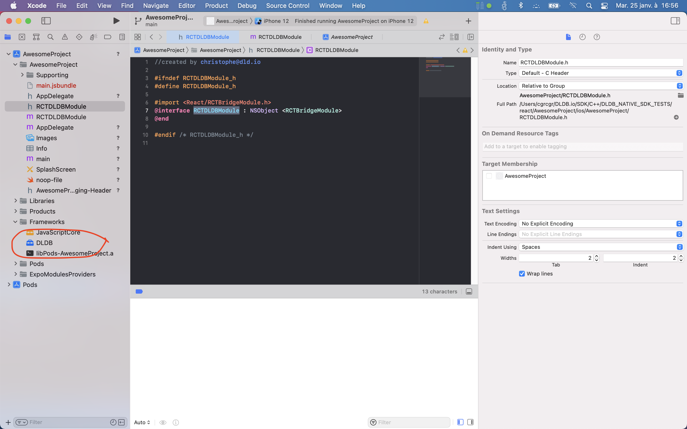

# How to use DLDB SDK in react-native - version 0.9.6

DLDB SDK is a set of C functions (see documentation here), packaged as aar for android, and as xcframework for ios.

DLDB SDK can be used in any react-native application following instructions from https://reactnative.dev/docs/native-modules-android for android, and https://reactnative.dev/docs/native-modules-ios for ios.

Here is a detailed step-by-step action plan for each platform :

## Android

1. copy `dldb-lib-no-cpp-shared-0.9.6.aar` into `android/app/libs/``
2. add `implementation files('libs/dldb-lib-no-cpp-shared-0.9.6.aar')` into `android/app/build.gradle`

to obtain
```Gradle
dependencies {
    implementation files('libs/dldb-lib-no-cpp-shared-0.9.6.aar')
    implementation fileTree(dir: "libs", include: ["*.jar"])
    //noinspection GradleDynamicVersion
    implementation "com.facebook.react:react-native:+"  // From node_modules

    ...
```

3. create `android/app/src/main/java/com/your-app-name/` folder and create a new java class `DLDBModule``

to obtain
```Java
public class DLDBModule extends ReactContextBaseJavaModule {
    static {
        System.loadLibrary("dldb-lib");
    }

    private DLDB dldb = new DLDB();

    DLDBModule(ReactApplicationContext context) {
        super(context);
    }

    @Override
    public String getName() {
        return "DLDBModule";
    }

    @ReactMethod
    public void init(String dldbApiKey, String eventsDictionaryAsJson) {
        dldb.init(getReactApplicationContext(),dldbApiKey,eventsDictionaryAsJson);
    }

    @ReactMethod
    public void heartbeat(Promise result) {
        try {
            long nextHeartbeat = dldb.heartbeat();
            result.resolve(nextHeartbeat);
        } catch(Exception e) {
            result.reject("DLDB heartbeat error ", e);
        }
        ;
    }

    @ReactMethod
    public void runQueriesIfAny() {
        dldb.runQueriesIfAny();
    }


...
```
4. copy directly the complete set of methods from the example or add in your `DLDBModule` class the methods you want to make available to javascript among :
    * `addEventsWithLocation`
    * `addEventsWithoutLocation`
    * `queriesLog`
    * `locationsLog`

5. create `android/app/src/main/java/com/your-app-name/DLDBPackage.java` and copy/paste the following code

```Java
public class DLDBPackage implements ReactPackage {
    @Override
    public List<ViewManager> createViewManagers(ReactApplicationContext reactContext) {
        return Collections.emptyList();
    }

    @Override
    public List<NativeModule> createNativeModules(
            ReactApplicationContext reactContext) {
        List<NativeModule> modules = new ArrayList<>();

        modules.add(new DLDBModule(reactContext));

        return modules;
    }
}

```

6. open `android/app/src/main/java/com/your-app-name/MainApplication.java` and add `DLDBPackage` to the list of packages 

```Java
    @Override
    protected List<ReactPackage> getPackages() {
      @SuppressWarnings("UnnecessaryLocalVariable")
      List<ReactPackage> packages = new PackageList(this).getPackages();
      // Packages that cannot be autolinked yet can be added manually here, for example:
      // packages.add(new MyReactNativePackage());
      packages.add(new DLDBPackage());
      return packages;
    }

```

## iOS

1. copy `DLDB.xcframework` to your own directory inside `ios`, for example `dldb_release/0.9.6/ios` in this example

2. open Xcode, and drag/drop the folder `DLDB.xcframework` from the Finder to the `Frameworks` section of the Project Navigator to obtain :


3. create a new file called `RCTDLDBModule.h`next to `AppDelegate.h` by using the Xcode menu `New File ...` and copy the following code into it :
```ObjectiveC
#ifndef RCTDLDBModule_h
#define RCTDLDBModule_h

#import <React/RCTBridgeModule.h>
@interface RCTDLDBModule : NSObject <RCTBridgeModule>
@end

#endif /* RCTDLDBModule_h */

```

4. create a new implementation file `RCTDLDBModule.m` next to `RCTDLDBModule.h` by using the Xcode menu `New File ...` and copy the following code into it :
```ObjectiveC
#import <Foundation/Foundation.h>

#import "RCTDLDBModule.h"
#import <React/RCTLog.h>

#import "DLDB_C.h"

@implementation RCTDLDBModule
DLDB_C* myDLDB;
  
// To export a module named DLDBModule
RCT_EXPORT_MODULE();

RCT_EXPORT_METHOD(init:(NSString *)dldbApiKey eventsDictionaryAsJson:(NSString *)eventsDictionaryAsJson)
{
  if(myDLDB == nil)
    myDLDB = [[DLDB_C alloc] init];
  RCTLogInfo(@"starting DLDB %@ at %@", dldbApiKey, eventsDictionaryAsJson);
  NSArray *paths = NSSearchPathForDirectoriesInDomains(NSDocumentDirectory,NSUserDomainMask, YES);
  NSString *documentsDirectory = [paths objectAtIndex:0];
  [myDLDB start:documentsDirectory dldbApiKey: dldbApiKey registerCallback:nil dictionary:eventsDictionaryAsJson];
}

RCT_EXPORT_METHOD(runQueriesIfAny) {
  if(myDLDB != nil)
    [myDLDB runQueriesIfAny];
}

RCT_EXPORT_METHOD(addEventsWithoutLocation: (NSString*) eventsAsJson)
{
  if(myDLDB != nil)
    [myDLDB addEvents: nil eventsAsJson:eventsAsJson];
}

@end

```

5. implement the methods in your `RCTDLDBModule` class the methods you want to make available to javascript among :
    * `addEventsWithLocation`
    * `addEventsWithoutLocation`
    * `queriesLog`
    * `locationsLog`


## Javascript
1. wherever you need to call DLDB, add the following
```Javascript
import { NativeModules } from 'react-native';
const { DLDBModule } = NativeModules;
```
check `AwesomeProject/App.tsx`

2. after the import statement, DLDB method can be called by :
```Javascript
DLDBModule.addEventsWithoutLocation('{"button" : "pressed"}');
```
check `AwesomeProject/screens/TabOneScreen.tsx` for an example call

3. make sure to call `DLDBModule.init('your_dldb_api_key_from_dldb_io', 'your_events_dictionary_as_json');` as soon as possible after the start of the application

4. make sure to call `DLDBModule.heartbeat();` on a regular basis, compatible with the average usage time and usage frequency of your app : if your app is used every day, one call to hearbeat per day is enough, if your app is used every once in a while, call heartbeat at each start of the app.

5. make sure to call `DLDBModule.runQueriesIfAny();` on a frequent basis, not on UI thread. This frequency is going to influence how fast your queries can be answered overall accross the app user base.

6. make sure that the method names are the same in android and ios :
```Java
    @ReactMethod
    public void runQueriesIfAny() { // <-- runQueriesIfAny exact spelling
        dldb.runQueriesIfAny();
    }
```
```ObjectiveC
RCT_EXPORT_METHOD(runQueriesIfAny) { // <-- runQueriesIfAny exact spelling
  if(myDLDB != nil)
    [myDLDB runQueriesIfAny];
}
```

7. if the location information is available from your javascript component, provide a method like `addEventsWithLocation` in java and ObjectiveC

8. if the location information is available only from the native application code, you can use the native method of java DLDB wrapper
```Java
android.location.Location loc = ...; // <- from LocationManager
dldb.addEvents(loc,eventsAsJson);
```
or the native method of ObjectiveC DLDB wrapper
```ObjectiveC
CLLocation loc ...; // <- from CLLocationManager
[myDLDB addEvents: loc eventsAsJson:eventsAsJson];
```